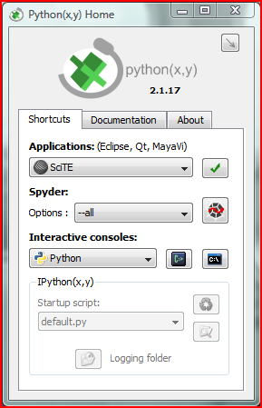
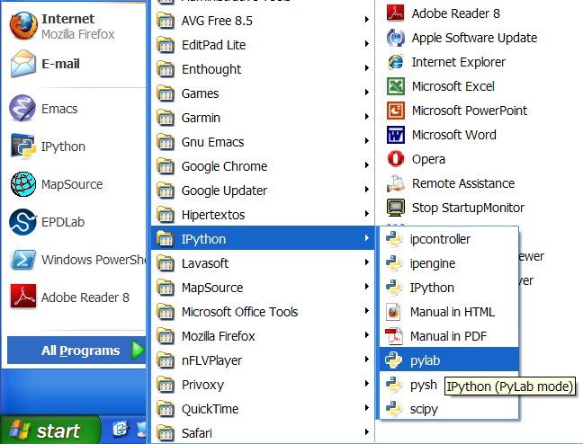

.. _getting_started:

================
Getting started
================

It can be a bit bewildering for a newcomer to Python to figure out
where to start.  Unlike many environments in which people do
scientific computing, Python is a programming language.  Matlab (TM),
Mathematica (TM), IDL (TM), R, Sage, are all *environments* for
computing: they all provide a scripting language, an interactive
shell, a code editor and debugger, a graphics library, integrated
documentation and numerical algorithms built-in.  By contrast, Python
is a programming language which has some of these things built-in, but
it is not designed to be an environment for scientific computing.  It
can be, and is, the basis of a top-notch scientific computing
environment, but these pieces have to be assembled.  Many newcomers to
Python feel overwhelmed by the multitude of choices.

The freedom to assemble the pieces as you like is a blessing for the
advanced researcher or programmer, but it can be a curse for the
newcomer who wants things to just work out of the box without too
much assembly required.  Fortunately, there are sophisticated packages
like the Enthought Python Distribution (EPD) and Python(x,y), which do
provide a comprehensive environment for scientific computing in a
single click installer.  We encourage people to use these packages,
particularly those just getting started with Python.  Once you get
past the beginner stage, if you don't mind wrestling with some
compilation and installation issues, you will get the most out of open
source software if you assemble your own stack, because the true
strength of open source is that an army of volunteers are continuously
fixing and improving the existing software, and often the version that
provides some feature you want or bug you need fixed is the one that
is living in the source code repository not yet released.

In this chapter, we provide a tutorial introduction to the Python
packages which form the core stack of scientific computing tools in
Python.  There are many important packages we leave out -- for some
applications these we leave out may be the critical and essential
tool.  We'll try and mention as many of these as possible as we
progress.

.. ipython::
   :suppress:

   # set up ipython for plotting in pylab
   In [4]: from pylab import *

   In [5]: ion()

   In [6]: bookmark ipy_start

.. _mins:

MINS
====

The basic components we need are: a good programming language
(Python), a code editor (you decide), an interactive shell in which to
type commands and explore data (IPython), support for efficient array
based computations (numpy), a library of efficient scientific
algorithms (scipy), the ability to make scientific graphs (matplotlib)
and support for efficient interactive 3D visualization (MayaVi).
There are many other other wonderful packages out there, some of which
are absolutely essential for certain kinds of work, but with Python
and (M)atplotlib, (I)Python, (N)umpy and (S)cipy (MINS) you can
achieve a fantastic level of productivity, and these tools alone are
all that many people need, particularly at the student level.  As
people progress, they bring in many more packages into their daily
workflow -- nonetheless, these packages are sufficiently powerful and
scalable that they remain the core tools for most users.

We'll explore each of these components in turn.  Because there are a
variety of ways to install Python and associated tools across the
major platforms, we won't cover this here, since one size does not fit
all.  There are good turn-key solutions like EPD and Python(x,y) for
getting everything in an easy installer, so we'll assume you have
either installed everything from one of these packages or have
installed the components yourself.  Note that while Python(x,y) is
completely free for academic and commercial use, EPD is free only for
academic use and others can either try the demo version or pay a
licensing fee with various levels of support -- the academic download
is available at `EPD academic
<http://www.enthought.com/products/edudownload.php>`_


.. _python_getting_started:

The Python Language
===================

As we discussed at some length in :ref:`why_python`, the major reasons
to use Python for scientific computing are: the language itself, the
quality of the extensions, and inter-operability with other languages.
Some of the "everything under one roof" environments like Matlab and
IDL mentioned above leave something to be desired in the scripting
languages they provide.  Python, by contrast, is a first class
programming language with support for multiple popular programming
paradigms.  While you could implement a free-standing web application
server in Matlab, you probably wouldn't want to.  In contrast, the
*Curse of Python* is that it is so fun and easy to implement powerful
tools that people often prefer to "roll their own" web application
server, plotting library or machine learning toolkit rather than use
someone else's.  This is a bit tongue in cheek: over time communities
do coalesce around successful packages, but in early stages there is
often too much choice rather than too little simply because Python
developers enjoy writing Python code.


We'll introduce the basics of the python programming language below in
:ref:`python_mini_tutorial`.  For now, make sure you can fire up the
interactive interpreter.  In linux or OS X, to start the Python
interpreter you should open a terminal window and simply type
``python``.  In Windows, there will be an entry for Python in the
Start Menu, under a top-level folder like "Python" or "EPD" depending
on where you got your Python distribution from; Python(x,y) has a
launcher dialog from which you can choose from and launch different
interactive consoles and editors.  In the example below, the command
with the single prompt ``> python`` is executed in the the linux
terminal and starts the python interpreter, which uses the triple
prompt ```>>>``` for python commands passed to the interactive Python
interpreter::

  > python
  Python 2.6.4 (r264:75706, Nov  2 2009, 14:38:03)
  [GCC 4.4.1] on linux2
  Type "help", "copyright", "credits" or "license" for more information.
  >>> 2**100
  1267650600228229401496703205376L
  >>> x = 'This is not a pipe'
  >>> x.replace(' ', '_')
  'This_is_not_a_pipe'
  >>> for i in range(5):
  ...      print(i**2)
  ...
  0
  1
  4
  9
  16




   *The Python(x,y) launch utility* for windows and Ubuntu linux.
   Choose your editing environment under "Applications" and click the
   green check mark to launch.  Choose the "Interactive console", here
   the plain vanilla python interpreter but next we'll launch the much
   enhanced IPython interpreter


Now that we've tested the interactive interpreter, we want to write a
simple python script and make sure we can run it in python.  For this
you will need a code editor.  Many hardcore programmers use the plain
text editors emacs or vi, and there are endless debates and even
paintball wars to resolve which is superior.  We won't wade into that
particular debate except to say both are good choices and if you have
some time to invest in your future productivity, learning one of these
editors will pay off in spades, but does entail a significant
"up-front" cost.  There are a variety of choices for those who prefer
a graphical user interface environment for their editor, with the
traditional "File/Edit" menus for loading and saving files or doing
search-and-replace operations.  A good choice is `Idle
<http://docs.python.org/library/idle.html>`_, a tkinter based editor
which comes with the standard Python distribution.  Another good
choice is the `SciTE <http://www.scintilla.org/SciTE.html>`_ editor
which ships with Python(x,y) and EPD, runs across major platforms, and
supports python and most every other programming languages.  Essential
things to look for in an editor are: syntax highlighting, syntax aware
automatic indentation for code blocks, and the ability to use
whitespace instead of tabs for indentation. Google "python code
editor" for more information and see the `python editors
<http://wiki.python.org/moin/PythonEditors>`_ section of the Python
wiki.

Once you've selected your editor, create a simple file called
:file:`my_hello.py` and save it somewhere easy to navigate to on your
file system.  Our first script will print out the ASCII codes of the
characters in "Hello World".

.. sourcecode:: python

    mystring = 'Hello World'
    for c in mystring:
        print(c, ord(c))

and we can execute this file from the terminal (in windows you can get
access to a primitive terminal by running ``cmd.exe``)::


  > python test.py
  ('H', 72)
  ('e', 101)
  ('l', 108)
  ('l', 108)
  ('o', 111)
  (' ', 32)
  ('W', 87)
  ('o', 111)
  ('r', 114)
  ('l', 108)
  ('d', 100)


In Windows you can also execute a python file which ends in the suffix
".py" by double clicking on it.  When you double click on it, you
will see a command terminal window pop up, whatever output your
program generates will scroll by, and the window will immediately
disappear as soon as your program finishes.  For most programs, this
will happen in the blink of an eye, and you won't be able to see
what output your program generated.  You can prevent your program
from exiting by causing the execution to block waiting for input
from the user with a call to ``raw_input``.  Eg, for the test
program above, we could write::

  mystring = 'Hello World'
  for c in mystring:
      print(c, ord(c))

  raw_input("press any key to exit")

If you are running your program from the command like or a Python
editor like Idle, or better yet from the IPython shell which we
introduce below, this won't be necessary.


.. _ipython_getting_started:

IPython
========

The interactive interpreter is one of the core strengths of python.
Unlike the compiled languages C, FORTRAN and C++ which typically lead
to a work-flow where you write code, compile it, run it, find
problems, go back and insert diagnostic output, and wash-rinse-repeat,
with an interactive interpreter you can explore code and data as you
develop it.  The Python interpreter is useful for this, but is not the
full featured command shell you expect if you are used to modern
terminal environments like the bash shell.  A full-featured shell
includes the ability to navigate the file systems, set bookmarks on
favorite locations, use aliases for often typed commands, use command
completion, history and other readline features.  The "I" in IPython
stands for *Interactive* and it is a Python shell on steroids,
integrating all the features from the standard python shell with all
the desirable features just mentioned, and more.

For many people who do scientific computing in Python as part of their
research or employment, an open IPython shell is as much a feature of
their everyday work environment as a firefox web browser, a terminal
shell and a favorite editor.  For the rest of this book, we'll spend
*most* of our time in an IPython shell.  We can launch it from the
terminal -- EPD and Python(x,y) users can launch it from their
respective menus -- just like we launched the plain vanilla Python
interpreter above.  But this time we'll prefix our command with an
"i", and instead of seeing the familiar triple quoted prompt ``>>>``
from the Python interpreter, we see Mathematica-style numbered input
and output prompts::

  > ipython
  Python 2.6.4 (r264:75706, Nov  2 2009, 14:38:03)
  Type "copyright", "credits" or "license" for more information.

  IPython 0.10 -- An enhanced Interactive Python.
  ?         -> Introduction and overview of IPython's features.
  %quickref -> Quick reference.
  help      -> Python's own help system.
  object?   -> Details about 'object'. ?object also works, ?? prints more.

  In [1]: 2**100
  Out[1]: 1267650600228229401496703205376L


Getting help in IPython
------------------------

There are lots of features in IPython to help you explore the Python
objects you are working with.  Often you are handed some object
returned by a method call in numpy, scipy or matplotlib, and you are
not exactly sure what you have on your hands.  Your first three lines
of defense are the ``type`` function, ``help`` and its IPython cousins
``?`` and ``??``, and TAB which shows you a list of available
attributes and methods.  Let's look at this in action for a basic
string "somefile.dat" which is the name of a mythical file we plan to
do some work on.


.. ipython::

   In [128]: myfile = 'somefile.dat'

   In [129]: myfile
   Out[129]: 'somefile.dat'

   In [130]: type(myfile)
   Out[130]: <type 'str'>

You can do ``myfile?`` to see the basic help on the object.


.. ipython::
   :verbatim:

   In [148]: myfile?
   Type:           str
   Base Class:     <type 'str'>
   String Form:    somefile.dat
   Namespace:      Interactive
   Length:         12
   Docstring:
       str(object) -> string
       Return a nice string representation of the object.
       If the argument is a string, the return value is the same object.


Which isn't too helpful in this particular case.  Our last and most
valuable line of defense when seeking help is TAB completion, which
will list the complete set of methods of Python strings can be viewed
by typing ``a.<TAB>``

.. ipython::
   :verbatim:

   In [150]: myfile.<TAB>
   a.__add__          a.__init__      a.__setattr__ a.isdigit a.rsplit
   a.__class__        a.__le__        a.__str__     a.islower a.rstrip
   a.__contains__     a.__len__       a.capitalize  a.isspace a.split
   a.__delattr__      a.__lt__        a.center      a.istitle a.splitlines
   a.__doc__          a.__mod__       a.count       a.isupper a.startswith
   a.__eq__           a.__mul__       a.decode      a.join    a.strip
   a.__ge__           a.__ne__        a.encode      a.ljust   a.swapcase
   a.__getattribute__ a.__new__       a.endswith    a.lower   a.title
   a.__getitem__      a.__reduce__    a.expandtabs  a.lstrip  a.translate
   a.__getnewargs__   a.__reduce_ex__ a.find        a.replace a.upper
   a.__getslice__     a.__repr__      a.index       a.rfind   a.zfill
   a.__gt__           a.__rmod__      a.isalnum     a.rindex
   a.__hash__         a.__rmul__      a.isalpha     a.rjust


Each of these methods can be queried similarly with the ``?`` operator
as above.  For more details on Python strings and their companion
sequence types, see `string methods
<http://docs.python.org/library/stdtypes.html#string-methods>`_.  The
"double underscore" methods are special methods that make strings act
like strings, and are not important for most users of the basic string
services.  There are many other basic methods that *are* quite useful,
and we can use the ``?`` operator in IPython to get basic help on any
of these methods.

.. ipython::
   :verbatim:

   In [151]: myfile.upper?
   Type:           builtin_function_or_method
   Base Class:     <type 'builtin_function_or_method'>
   String Form:    <built-in method upper of str object at 0x980e2f0>
   Namespace:      Interactive
   Docstring:
       S.upper() -> string
       Return a copy of the string S converted to uppercase.


   In [152]: myfile.upper()
   Out[153]: 'SOMEFILE.DAT'


Another really useful feature in IPython is the double question mark
``??``.  The single question mark ``?`` brings up the *docstring* help
for the object you are interrogating; the double question mark ``??``
brings up the *source code* itself, if available.  This doesn't
*always* work, because some Python methods are written in compiled
binary code and the source is simply not available.  But for many
modules and methods, the source is written in Python and available.
For example, if you wanted to see the implementation of numpy's
``trapz``, which does trapezoidal integration, the ``??``
interrogation shows you not only the standard IPython help which
includes a header indicating the object type (in this case a
"function") the source code file, the method signature (the line
starting with ``def trapz``) and a docstring delineated by triple
quotes ``"""``, which we've partially elided here for brevity.
Additionally, ``??`` provides the actual sourcecode implementation below
the docstring::

  In [211]: import numpy as np

  In [212]: np.trapz??

  Type:             function
  Base Class:       <type 'function'>
  String Form:   <function trapz at 0x86528ec>
  Namespace:        Interactive
  File:             /home/titan/johnh/dev/lib/python2.4/site-packages/numpy/lib/function_base.py
  Definition:       np.trapz(y, x=None, dx=1.0, axis=-1)
  Source:
  def trapz(y, x=None, dx=1.0, axis=-1):
      """
      Integrate along the given axis using the composite trapezoidal rule.

      Integrate `y` (`x`) along given axis.
      ...snip lots of documentation...
      Examples
      --------
      >>> np.trapz([1,2,3])
      >>> 4.0
      >>> np.trapz([1,2,3], [4,6,8])
      >>> 8.0

      """
      y = asarray(y)
      if x is None:
	  d = dx
      else:
	  x = asarray(x)
	  if x.ndim == 1:
	      d = diff(x)
	      # reshape to correct shape
	      shape = [1]*y.ndim
	      shape[axis] = d.shape[0]
	      d = d.reshape(shape)
	  else:
	      d = diff(x, axis=axis)
      nd = len(y.shape)
      slice1 = [slice(None)]*nd
      slice2 = [slice(None)]*nd
      slice1[axis] = slice(1,None)
      slice2[axis] = slice(None,-1)
      return add.reduce(d * (y[slice1]+y[slice2])/2.0,axis)

Navigating the file-system and running scripts
--------------------------------------------------

In addition to being a full-featured Python interpreter, IPython also
has some magic commands to do things you cannot do in the standard
Python interpreter, like navigating the file system with ``cd``,
``mkdir`` and ``pwd``, inspecting file contents with ``less``,
executing systems commands with the ``!`` prefix, and running python
code from the IPython shell with the IPython magic command ``run``.

.. sourcecode:: ipython

  # use the ipython magic commands mkdir, cd and pwd to navigate the
  # file system, on Windows, Unix or OSX
  In [2]: mkdir mypy

  In [3]: cd mypy/
  /home/jdhunter/mypy

  # use pure Python commands to create a test file
  In [4]: fh = file('mydata.dat', 'w')

  In [5]: fh.write('this is a test')

  In [6]: fh.close()

  # use the IPython magic command ls to list the contents of the
  # current directory
  In [7]: ls
  mydata.dat

  # make a system call to "more" by prefixing the command with an
  # exclamation point to view the data file (ipython also has a
  # cross-platform magic command "less" but this is for illustration
  # of a system call).
  In [8]: !more mydata.dat
  this is a test


Perhaps the most useful magic command in the IPython arsenal is
``run`` which is used to run a python script on the system.  Open your
favorite IPython editor, create a simple test script named
:file:`myhello.py`, and save it on your local file system.  We'll put
it in the newly created :file:`mypy` directory from the example above.


.. sourcecode:: python

   hellostr = 'hello world'
   for word in hellostr.split():
       print(word, word[::-1])


First make sure you are in the right directory (``pwd``), that your
file is there (``ls``) and that it has the right contents (``cat``).
All of these commands are inspired by their UNIX cousins with the same
names, but they are actually IPython magic commands which work across
platforms.

.. ipython::
   :verbatim:

   In [6]: pwd
   Out[6]: '/home/jdhunter/mypy'

   In [7]: ls -l
   total 8
   -rw-r--r-- 1 jdhunter jdhunter 14 2010-04-14 13:16 mydata.dat
   -rw-r--r-- 1 jdhunter jdhunter 83 2010-04-14 13:16 myhello.py

   In [8]: cat myhello.py
   hellostr = 'hello world'
   for word in hellostr.split():
       print(word, word[::-1])

Note that no code has been executed yet; we've just inspected the
contents of the directory and the file :file:`myhello.py`.  To execute
the file in the current IPython interpreter, we need to ``run`` it.
First let's confirm that none of these variables exist in our
namespace.

.. ipython::
   :verbatim:

   In [9]: hellostr
   ---------------------------------------------------------------------------
   NameError                                 Traceback (most recent call last)
   /home/jdhunter/mypy/<ipython console> in <module>()
   NameError: name 'hellostr' is not defined

The Python exception ``NameError`` indicates that the variable name
``hellostr`` is not known to the Python interpreter in the local
namespace.  Now we run the script, which prints the words in "hello
world" forwards and backwards.

.. ipython::
   :verbatim:

   In [10]: run myhello.py
   ('hello', 'olleh')
   ('world', 'dlrow')

Not only is ``run`` convenient for executing scripts without having to
switch between the IPython shell and the terminal shell, it has a
couple of other important benefits as well.  For one, we don't have to
pay the startup time of the Python interpreter or any modules we
import every time we run the script as we enhance and debug it.  For
another, any variables, functions or classes defined in the script are
now accessible in our local IPython namespace for us to inspect and
continue working with.

.. ipython::
   :verbatim:

   In [16]: hellostr
   Out[16]: 'hello world'

   In [17]: hellostr.upper()
   Out[17]: 'HELLO WORLD'

Now we no longer get the ``NameError`` when we print the ``hellostr``
variable, because IPython placed it in our local namespace when we ran
the script.  There are lots of useful command options to run, notably
``-i`` to run a script in the context of the local namespace, ``-t``
to print timing information, ``-d`` to run under the debugger and
more.  We'll encounter these as we move along in more advanced
sections; execute ``run?`` at the IPython prompt for more information.

.. _python_mini_tutorial:

A Python Mini-Tutorial
======================

Python is a full-featured language which supports many programming
idioms, including procedural, functional, and object oriented
concepts.  It comes with a rich `standard library
<http://docs.python.org/library/>`_ consisting of *hundreds* of modules
in the standard installation.  There are many excellent tutorials
including the official `Python Tutorial
<http://docs.python.org/tutorial/index.html>`_ and free books online
such as `Dive Into Python <http://diveintopython.org/>`_ and other
excellent print books such as `The Python Essential Reference
<http://www.amazon.com/Python-Essential-Reference-David-Beazley/dp/0672329786/ref=sr_1_1?ie=UTF8&s=books&qid=1271019394&sr=8-1>`_
and the `Python Cookbook <http://oreilly.com/catalog/9780596001674>`_.


Many scientists and engineers want to solve a specific problem, eg, to
make a certain kind of graph, to numerically integrate an equation, or
to fit some data to a parametric model, and don't have the time or
interest to read several books or tutorials to get what they want.
This guide is for them: a short overview of the language to help them
get to what they want as quickly as possible.  We get to advanced
material pretty quickly in this book, so it may be tough sledding if
you are a python newbie.  Take in what you can, you can always come
back to absorb more detail later, and digest the excellent tutorials
and books referenced above as you have time.  We cannot begin to do
justice to the breadth and depth of material these resources cover and
we won't try.  Rather, we will provide just the bare minimum for the
reader who wants to get started right away using python for scientific
computing.  We assume you have some experience with another
programming language or two, and are comfortable with the concepts of
variable types, for loops, function calls, and compilers.  We'll help
you map these concepts into python.


Python is a dynamically typed, object oriented, interpreted language.
Interpreted means that your program interacts with the Python
interpreter, similar to Matlab, Perl, Tcl and Java, and unlike
FORTRAN, C, or C++ which are compiled.  By this point, you should know
how to start the Python and IPython interpreters.  You don't need
IPython to learn Python itself, but since this is the environment
we'll be using throughout the book, and since it is so helpful for
inspecting and getting help on objects in python, we'll be using
IPython in this mini-python tutorial.


Python as a calculator
----------------------

You can use Python as a powerful calculator.

.. ipython::

   In [5]: 2+2
   Out[5]: 4

   In [6]: 123 * 234
   Out[6]: 28782

   In [7]: 2**100
   Out[7]: 1267650600228229401496703205376L

The basic mathematical functions like sqrt, exp, and sin, as well as
numerical constants like $e$ and $\pi$ are provided by the standard
library module `math <http://docs.python.org/library/math.html>`_,
which must be explicitly imported.

.. ipython::

   In [234]: import math

   In [235]: math.sin(2*math.pi)
   Out[235]: -2.4492127076447545e-16

Notice that the result -- though close to zero -- is not exactly zero, due
to the floating point limitations in the representation of $\pi$ and
the implementation of ``sin``.

Although the floating point representation is limited to the size of a
C-double, Python does support arbitrarily large integers in its long
type (unlike a C long which is at least 4 bytes but has a finite
size).  So you can compute arbitrarily large integer arithmetic
expressions in Python, limited only by your computer's memory and
processor.

There are two common confusions in Python involving floating point
numbers.  The first potential gotcha to be aware of (in Python 2.x but
not 3.x) for those with limited experience in Python or C is that the
ratio of two integers is always an integer, truncated to the nearest
integer.  So 1/2 returns 0, not the expected 0.5.  If you want
floating point division, make sure either the numerator or denominator
or both is a floating point number.

.. ipython::

   In [239]: 1/2
   @verbatim
   Out[239]: 0

   In [240]: 1.0/2.0
   Out[240]: 0.5

This wart -- or feature depending on your worldview -- was removed in
Python 3.0, which introduced a new operator ``//`` for those who want
integer division to return an integer, and defines the ``/`` division
operator to always return a floating point number regardless of
whether the numerator or denominator are integers or floating points
numbers.

The other floating point surprise for new users is the representation
of numbers like 1/10 or 2/3, which reflects the limited accuracy of
binary floating point storage.

.. ipython::

   In [242]: 0.1
   @verbatim
   Out[242]: 0.10000000000000001


   In [243]: 2/3.
   @verbatim
   Out[243]: 0.66666666666666663


You may see different numbers on your machine, because the
representation depends on the number of bits your hardware uses to
store floating point numbers; for more information see the `floating
point tutorial <http://docs.python.org/tutorial/floatingpoint.html>`_.


Python is dynamically typed
-----------------------------

In the example above we computed $2^{100}$.

.. ipython::

   In [7]: 2**100
   Out[7]: 1267650600228229401496703205376L


The "L" at the end of the last example is interesting.  It means that
the result of $2^{100}$ in Python is a ``long`` integer, unlike the
plain integers 2 and 100.  Python is dynamically typed, and there are
several built-in numerical types such as ``int``, ``long``, ``float``
and ``complex`` to represent numerical data.  Let's explore this for
the numbers in the example above using Python's built-in ``type``
function, which takes a Python object as input and returns the type of
the object.

.. ipython::

   In [8]: type(2)
   Out[8]: <type 'int'>

   In [9]: type(2**100)
   Out[9]: <type 'long'>

Unlike C or C++, in which we declare a variable like ``int x`` and
``x`` will for now and forever more be an integer, in Python the
variables are names which point to objects, and a name can be
reassigned to a different object of a different type at any time.
Let's see this in action where we assign the name ``x`` to the largest
integer available on my 32-bit system, and then add 1 to it.  This
will overflow the maximum ``int`` into a ``long``.  On a 32-bit
system, the largest signed integer is $2^{31}-1$ and on a 64-bit
system it is $2^{63}-1$.  Regardless of your platform, the largest
``int`` can be found in the standard library module ``sys`` as
``sys.maxint``, and the largest ``int`` will overflow if we add one to
it.

.. ipython::

   In [221]: import sys

   # the largest integer on a 32 bit system 2^31-1; on a 64 bit system
   # it is 2^63-1
   In [222]: sys.maxint
   Out[222]: 2147483647

   In [223]: x = sys.maxint

   # x is an int
   In [224]: type(x)
   Out[224]: <type 'int'>

   In [225]: x
   Out[225]: 2147483647

   # if we add 1, we overflow from int -> long
   In [226]: x = x+1

   # x is now a long
   In [227]: type(x)
   Out[227]: <type 'long'>

   In [228]: x
   Out[228]: 2147483648L

In the example above the name ``x`` was initially assigned to an
``int`` and subsequently assigned to a ``long``.  Likewise, we can
simply reassign the name ``x`` to any other type such as a string.

.. ipython::

   In [230]: x = 'this is a string'

   In [231]: x
   Out[231]: 'this is a string'

In this sense Python is dynamically typed.  The objects have types: an
int is an int and a string is a string.  But we can reassign any name
which points to an object of a given type to another object of another
type as desired, and often we care less about the type of an object a
name points to than we do about how it performs.  This is the concept
of *duck-typing*: if something walks like a duck and quacks like a
duck, we may not care whether or not it is a duck.  We only care
whether it behaves like a duck.

The basic data containers: tuple, list, dict, set
--------------------------------------------------

So far we've seen a few basic types in action: ``int``, ``long`` and
``string``.  One of the strengths of Python is the power of its basic
data structures for storing collections of data.  The built-in
language has ``tuple``, ``list``, ``dict`` and ``set``, and the
standard library has many more, such as binary trees and several queue
structures among others.  Let's explore the basic types.

The two primary sequence containers are tuples and lists.  For the
newcomer, it is often confusing why there are two -- we'll get into
that in a minute.  First, let's look at how they are constructed and
what their differences are.  The ``tuple`` is an immutable sequence,
which means once it has been created it cannot be changed.  It is
created using either the ``tuple`` constructor or the parentheses syntax.

.. ipython::

   In [254]: x = (2,3,5,8,13)

   In [255]: type(x)
   Out[255]: <type 'tuple'>

   In [256]: x[0]
   Out[256]: 2

   @verbatim
   In [257]: x[0] = 12
   ---------------------------------------------------------------------------
   TypeError: 'tuple' object does not support item assignment


The last error is because we tried to write to the tuple, which is
immutable.

The ``list``, however, is much like the tuple except that it is
mutable (changeable): we can grow the list, shrink it, delete items
from it, or change an element of the list.  A list is constructed
using the ``list`` constructor or square brackets.  You can add any
type of data you want to a list or tuple; the most common case is to
add data of the same type, eg all strings or all numbers, but this is
not required.  In the example below, we add some non-numeric data to
our list.

.. ipython::

   In [258]: x = [2, 3, 5, 8, 13]

   In [259]: type(x)
   Out[259]: <type 'list'>

   # a list, unlike a tuple, supports assignment
   In [260]: x[0] = 12

   In [261]: x
   Out[261]: [12, 3, 5, 8, 13]

   # and we can mix arbitrary data types in the list
   In [262]: x.append('this is not a pipe')

   In [263]: x
   Out[263]: [12, 3, 5, 8, 13, 'this is not a pipe']

   # we can also delete elements; the 0 index is the first element,
   # and the 1 index is the second element since Python indexing
   # starts at 0, so here we are removing the element 3
   In [264]: del x[1]

   In [265]: x
   Out[265]: [12, 5, 8, 13, 'this is not a pipe']

Python also supports fancy slice indexing, which is very useful and
powerful with numpy arrays which have the same syntax.  Since we cover
it below in the introduction to numpy, we'll leave the detailed
explanation for later (:ref:`numpy_indexing_slicing`), and only
demonstrate it in the example below in which we slice out every 2nd
element.

.. ipython::

   In [266]: x[::2]
   Out[266]: [12, 8, 'this is not a pipe']

The dictionary is the associative array data structure in Python, and
is one of the most useful and powerful types in the language.  Many of
the internals of the language are implemented in dictionaries, with
the result that the ``dict`` is efficient and robust.  The dictionary
maps keys to values: they key can be any immutable data type and the
value can be any python object.  Technically, the requirement for a
key to a dictionary is that it has a unique hash; as you can easily
verify tuples are hashable with ``hash((1,2,3))`` and lists are not
with ``hash([1,2,3])``.

One typical use of a dictionary is to store a bunch of different data
types in a single data structure -- a class is another and perhaps
better way to achieve the same thing, and not coincidentally, a
dictionary underpins the basic class machinery, as we will see later.
Consider a dictionary representing a person, which stores their age,
weight and name.

.. ipython::

   In [11]: person0 = {'name' : 'Bill', 'age' : 12, 'weight' : 65.0}

   In [12]: person1 = {'name' : 'Sally', 'age' : 14, 'weight' : 95.0}

The keys of these dictionaries are all strings: 'name', 'age', and
'weight', though they needn't be.  We could just as well use integers,
tuples, class instances, or other immutable types as keys.

.. note::

  When the keys of a dictionary are all strings and valid python
  names, you use the alternative key/value constructor syntax with the
  ``dict`` constructor.  For example::


    person0 = dict(name='Bill', age=12, weight=65.0)


You can index into a dictionary with the key name to read or write the
value assigned to that key.

.. ipython::

   In [19]: person0['name']
   Out[19]: 'Bill'

   In [20]: person0['name'] = 'Jane'

   In [21]: person0
   @verbatim
   Out[21]: {'age': 12, 'name': 'Jane', 'weight': 65.0}


Notice in the example above that the keys are not in the same order
we used when defining the dictionary.  This is an important fact
about dictionaries to remember: the keys are unordered.  There are
many important methods of dictionaries, but three that are used all
the time are ``keys`` which returns an unordered list of keys in the
dictionary, ``values`` which returns an unordered list of values in
the dictionary, and ``items``, which returns a list of (key, value)
tuples, as shown below for ``person0``.

.. ipython::

   In [22]: person0.keys()
   Out[22]: ['age', 'name', 'weight']

   In [23]: person0.values()
   Out[23]: [12, 'Jane', 65.0]

   In [24]: person0.items()
   Out[24]: [('age', 12), ('name', 'Jane'), ('weight', 65.0)]

Python data structures are flexible: for example, you can easily
create a list of dictionaries.

.. ipython::

  In [25]: mylist = [person0, person1]

  In [26]: mylist
  Out[26]:
  [{'age': 12, 'name': 'Jane', 'weight': 65.0},
   {'age': 14, 'name': 'Sally', 'weight': 95.0}]

or you can make a dictionary key point to another dictionary as a
value, though you can't use a dictionary itself as the key in a
dictionary since the keys must be immutable and as we have seen above
when we changed the name of ``person0`` to "Jane", the dictionary is
mutable.

Another common usage of dictionaries is to store or cache values which
you plan to use over and over again, particularly if the computation
of those values is expensive.  For example, to store the cubes of the
the first 100 perfect squares in a dictionary, you could use the
following.

.. sourcecode:: python

    squared = dict()
    for i in range(100):
        i2 = i**2
        squared[i2] = i2**3


    print squared[9]  # prints 729

This particular example may not be the best one, since the computation
of ${i^2}^3$ may be cheaper than the dictionary lookup, but in general
whenever you have an expensive computation to perform and you want to
cache the results for later reuse, a dictionary is the goto data
structure for this task.  In the section of list and generator
comprehensions below, we will discuss a syntactically simpler way to
create the ``squared`` dictionary which takes advantage of the fact
that a dictionary can be initialized with a sequence of (key, value)
tuples.

.. sourcecode:: python

    squared = dict( (i**2, i**6) for i in range(100) )


The final built-in data container we will look at is the ``set``,
which behaves like the mathematical set.  It works like a dictionary
with only keys and no values.  Like ``dict`` keys, the elements of a
``set`` must be immutable, and they are unordered.  The set is built
for efficient containment lookup, and set-wise operations like union,
intersection and set differences.  Let's look at two different
Fibonacci series.


.. ipython::

   In [64]: fib0 = set([1, 1, 2, 3, 5, 8, 13, 21, 34])

   In [65]: fib1 = set([2, 5, 7, 12, 19, 31, 50])

   In [66]: 8 in fib0
   Out[66]: True

   In [67]: 8 in fib1
   Out[67]: False


Set-wise operations like union, intersection and set
different are easy.

.. ipython::

   # union
   In [68]: fib0 & fib1
   Out[68]: set([2, 5])

   # intersection
   In [69]: fib0 | fib1
   Out[69]: set([1, 2, 3, 5, 7, 8, 12, 13, 19, 21, 31, 34, 50])

   # set difference
   In [70]: fib0 - fib1
   Out[70]: set([1, 3, 8, 13, 21, 34])


Additionally, you can easily ``add`` or ``remove`` existing elements
of a set.  Here we "mistakenly" add a bogus element 56 to the ``fib0``
series when we mean to add 55, so we correct the error by adding 55
and then removing 56.

.. ipython::

   # oops, wrong number
   In [77]: fib0.add(56)

   In [78]: fib0
   Out[78]: set([1, 2, 3, 5, 8, 13, 21, 34, 56])

   # add the correct number
   In [79]: fib0.add(55)

   # remove the bogus number
   In [80]: fib0.remove(56)

   # all good
   In [81]: fib0
   Out[81]: set([1, 2, 3, 5, 8, 13, 21, 34, 55])

That's it for an introduction to the basic python data container
structures ``tuple``, ``list``, ``dict`` and ``set``.  The
`collections <http://docs.python.org/library/collections.html>`_
module in the standard library contains many more useful data
structures, such as deque, ordered set, and named tuples.


Strings
------------

Python has very good infrastructure for processing strings.  Like
``int``, ``float`` and ``complex``, a ``string`` is a basic type in
python.  We saw a list of the methods available on strings in the
basic IPython workflow introduction.  Although there is far too much
functionality in the basic string to be covered here, and you can read
about them in the standard library string `documentation
<http://docs.python.org/library/stdtypes.html#string-methods>`_, we'll
mention a few of the really useful methods here.

``find`` returns the index of the first occurrence of a character or
sub-string passed as input to the method.  If the sub-string does not
occur, it returns -1.

.. ipython::

   In [151]: myfile
   Out[151]: 'somefile.dat'

   In [152]: myfile.find('jdh')
   Out[152]: -1

   In [153]: myfile.find('file')
   Out[153]: 4

``split`` will split the string on the indicated character or
substring into a list of strings.  The default is to split on white
space, but you can split on any other character, substring, newlines,
of even the empty string itself (which just returns a list of
characters).

.. ipython::

   # there is no whitespace so the whole string is returned
   In [154]: myfile.split(' ')
   Out[154]: ['somefile.dat']

   In [155]: myfile.split('.')
   Out[155]: ['somefile', 'dat']

   In [156]: myfile.split('file')
   Out[156]: ['some', '.dat']

The case methods ``upper``, ``lower`` and ``capitalize`` are
straightforward but useful, returning "SOMEFILE.DAT", "somefile.dat"
and "Somefile.dat" respectively for the string "somefile.dat".

Another useful method is ``startswith`` (and its cousin ``endswith``)
to determine whether a string starts or ends with a given substring,
which often arises when checking file types.  Notice in the
example below that the ``lower`` method returns a string itself, so we
can chain together in a pipeline the ``lower`` and ``endswith``
methods to perform a case-insensitive check to see if our filename
ends with "csv".

.. ipython::

   In [160]: if myfile.lower().endswith('csv'):
      .....:     print("do something with CSV file")
      .....:
      .....:

Python also has support for regular expressions in the `re
<http://docs.python.org/library/re.html>`_ standard library module.
They are not built into the basic string types as they are in Perl,
and Python programmers often ascribe Jamie Zawinski's view: *Some
people, when confronted with a problem, think "I know, I'll use
regular expressions." Now they have two problems.* Which is to say,
there are many problems which can be better solved with basic string
methods that do not need the full machinery of regular expressions.
But Python does have full support when you do need them.

A typical case arises in file processing, in which you may have a list
of files like :file:`energy001.dat`, :file:`energy002.dat`,
:file:`matter001.dat`, :file:`matter1024.dat` and you want to extract
both the basename ("energy" or "matter") as well as the file number,
perhaps as an integer.  Regular expressions are good for this.

.. ipython::

   In [197]: fname = 'energy001.dat'

   In [198]: import re

   In [199]: rgx = re.compile('([a-z]+)(\d+)\.dat')

   In [200]: m = rgx.match(fname)

   In [201]: m.group(1)
   Out[201]: 'energy'

   In [202]: m.group(2)
   Out[202]: '001'

Let's deconstruct this regular expression.  The stuff between the two
groups of parentheses are groups 1 and 2, which we want to extract
later with ``m.group(1)`` and ``m.group(2)``.  The first group match
string is ``[a-z]+`` which means "one or more characters between a and
z"; this will match the basename, eg "energy" or "matter" or any other
lower case purely alphabetical string.  The second group is ``\d+``
which means "one or more digits" and matches the file number.  The
last part of the regular expression, which is not grouped by
parentheses, is ``\.dat``; we use the literal slash to quote the
period because '.' has a special meaning "match any character" in
regular expressions and here we want to refer to the literal period
separating the filename from the extension.  The return object ``m``
in ``m = rgx.match(fname)`` is the regular expression match object,
and will be ``None`` if no match occurs.

Flow control: if, for and while
--------------------------------

Python is unusual in that it uses whitespace and colons to designate
code blocks.  For example, in C/C++, we use curly braces to delineate
the scope of an if/for/while clause, eg::

  if (x==1) {
    printf("x is one!\n");   // this is executed iff x==1
    x += 1;                  // and so is this
  }

  printf("you are here\n");  // this is executed unconditionally


and in python we use whitespace indendation rather than curly braces
to designate the flow that is scoped by the ``if`` clause.

.. sourcecode:: python

  if (x==1):
    print("x is one!")  # this is executed iff x==1
    x += 1              # and so is this

  print("you are here") # this is executed unconditionally

Python also optionally supports ``else if`` and ``else`` blocks.

.. sourcecode:: python

  if (x==1):
    print("x is one")
  else if (x==2):
    print("x is two")
  else:
    print("x is not one or two")

You can have zero or an unlimited number of ``else if`` clauses, and the
first one that meets the "True" condition is executed and the
subsequent condition/code blocks are short circuited.

The ``for`` loop in python is particularly simple.  You can iterate
over any sequence, including tuples, lists, dictionaries, sets,
strings and more using the same "for ELEMENT in SOME_SEQUENCE" syntax.
In the example below, we iterate over the characters in a string.

.. sourcecode:: python

   for somechar in 'This is not a pipe':
       print(somechar, ord(somechar))

Similarly, you can iterate over a list of integers.

.. sourcecode:: python

  for someint in [2, 3, 5, 8, 13, 21]:
    x = 2*someint
    print(x, x**2)

Like the ``if`` block, all of the lines in the ``for`` block which are
indented with respect to the "for" statement are executed for each
ELEMENT in the sequence until the first unindented line (or a
``break``) is encountered.

One handy built-in function is ``enumerate``, which takes a sequence
as input and returns a iterable sequence of (i, element) where i is
the count, or index, of the position of the i-th element in the
sequence.  For example, if you want to iterate over a list of lines,
and break after you have processed 100 lines, a common idiom is

.. sourcecode:: python

    for i, line in enumerate(lines):
       line = line.upper()  # do something with line
       print(line)
       if i==100:
           break

``while`` follows a similar pattern.  Here is an example from IPython,
which uses the leading dots "..." to indicate an indented block.

.. ipython::

   In [94]: i = 5

   In [95]: while i<1000:
      ....:     i = i**2
      ....:     print(i)
      ....:
      ....:
   25
   625
   390625

You can write indented blocks in an interactive IPython session.  The
primary difference is that IPython requires two empty/blank lines to
terminate the indented block.


List and generator comprehensions
---------------------------------

Python provides a handy syntax for writing loop one-liners: the
generator and list comprehensions.  A list comprehension uses the
square brackets as the regular list constructor, but allows you to
write a for loop inside the brackets to create the list.  For example,
to create a list of the first 5 perfect squares, we could use a list
comprehension (later we'll see numpy has more efficient ways of doing
the same thing for numbers, but list comprehensions are useful for
many non-numeric operations on sequences).

.. ipython::

   In [95]: x = [i**2 for i in range(5)]

   In [96]: x
   Out[96]: [0, 1, 4, 9, 16]


Similarly, we could create a list of some of the characters in the ASCII character set

.. ipython::

   In [103]: [chr(i) for i in range(55, 70)]
   Out[103]: ['7', '8', '9', ':', ';', '<', '=', '>', '?', '@', 'A', 'B', 'C', 'D', 'E']


You can create lists of other data structures, such as a list of (key,
value) tuples.  Here we create a mapping from words to their lengths.

.. ipython::

   In [112]: sentence = 'this is not a pipe'

   In [113]: wordlens = [(word, len(word)) for word in sentence.split()]

   In [114]: wordlens
   Out[114]: [('this', 4), ('is', 2), ('not', 3), ('a', 1), ('pipe', 4)]

We mentioned above that you can pass a list of (key, value) tuples
into the ``dict`` constructor, and this a a very-handy way to create a
dictionary, "on the fly".  Typically we would write a one-liner.

.. ipython::

   In [115]: wordlend = dict((word, len(word)) for word in sentence.split())

   In [116]: wordlend['this']
   Out[116]: 4

Note we omitted the square brackets in the ``dict`` constructor above
-- this is a generator comprehension rather than a list comprehension.
The generator comprehension is very similar to the list comprehension
except it is denoted with parentheses rather than square brackets.
The important difference is that the list comprehension is constructed
entirely in memory, but the generator comprehension takes advantage of
python generators to consume sequences as they are generated, on the
fly, rather than all at once in memory.  For example, the python
built-in function ``sum`` takes a sequence as input and computes the
sum on the fly, without having to store the entire sequence in memory,
which can be useful if you need to operate over data that cannot be
read into memory, for example some data streaming from disk or over a
socket.

.. ipython::

   In [118]: sum(i**2 for i in range(4096))
   Out[118]: 22898104320L


Files and Paths
----------------

In scientific and engineering applications, a lot of data resides on
the file systems, some of it in standard formats like HDF5, some in
flat text file formats like CSV, some in proprietary or custom binary
formats, and some compressed and archived in tar or zip files.  Python
has excellent support for all of these and more through an amazing
array of built-in functions and standard modules, and an equally
amazing array of third party tools such as those provided by numpy,
scipy, matplotlib, and beyond.  The basic workhorse of reading and
writing files is the built-in ``file`` command.

We've seen above the use of ``file`` to write a test file.  It's even
easier to read a file. Create a CSV file called :file:`birthdays.csv`
with the following contents::

  First,Last,Age,Weight,Height,Birthday
  John,Hunter,36,175,180,1968-03-05
  Miriam,Sierig,33,135,177,1971-05-04
  Rahel,Hunter,7,55,134,1998-02-25
  Ava,Hunter,3,45,121,2001-04-26
  Clara,Hunter,0,15,55,2004-10-02

It turns out Python and the scientific extension tools we'll be
presenting in this book make it trivial to load CSV files.  Python has
a built-in ``csv`` module in the standard library and numpy has
``np.loadtxt`` and matplotlib has ``mlab.csv2rec`` so you will rarely
need to parse an actual CSV file manually.  But in this example, we'll
work with the raw text as an illustration of how to read and parse
files.

We can use the ``read`` method of ``file`` to read the entire file in
as a single string.

.. ipython::

   In [53]: cd bookdata/
   /home/jdhunter/py4science/book/bookdata

   In [54]: s = file('birthdays.csv').read()

   In [55]: type(s)
   Out[55]: <type 'str'>

   In [56]: len(s)
   Out[56]: 204

   In [59]: print(s)
   First,Last,Age,Weight,Height,Birthday
   John,Hunter,36,175,180,1968-03-05
   Miriam,Sierig,33,135,177,1971-05-04
   Rahel,Hunter,7,55,134,1998-02-25
   Ava,Hunter,3,45,121,2001-04-26
   Clara,Hunter,0,15,55,2004-10-02

You can use ``readlines`` to get as list of lines from the file.

.. ipython::

   In [60]: lines = file('birthdays.csv').readlines()

   In [61]: lines
   Out[61]:
   ['First,Last,Age,Weight,Height,Birthday\n',
    'John,Hunter,36,175,180,1968-03-05\n',
    'Miriam,Sierig,33,135,177,1971-05-04\n',
    'Rahel,Hunter,7,55,134,1998-02-25\n',
    'Ava,Hunter,3,45,121,2001-04-26\n',
    'Clara,Hunter,0,15,55,2004-10-02\n']

Alternatively, you can iterate over the file object directly, one line
at a time.  Here we have a simple script to iterate over the
:file:`birthdays.csv` file, split the lines on the commas, and convert
the numeric data to integers and floats::

  data = []
  for i, line in enumerate(file('birthdays.csv')):
      if i==0: continue    # skip the header
      line = line.strip()  # remove the newline
      first, last, age, weight, height, birthday = line.split(',')
      d = dict(first=first, last=last, age=int(age),
	       weight=float(weight), height=float(height),
	       birthday=birthday)
      data.append(d)

  print(data)

As mentioned above, there are better utilities for parsing CSV files,
and there are better data structures for storing this kind of data --
namely numpy record arrays.  In this script we use a list of Python
dictionaries, which works, but as we will see the numpy record and
structured arrays are ideal for storing this kind of heterogeneous
tabular data.

The file API is quite ubiquitous in Python and the standard library.
For example, the ``gzip`` module allows you to open :file:`gz`
compressed files transparently and work with them as if they were the
plain text, uncompressed files.

.. ipython::

   In [76]: import gzip

   In [77]: s = gzip.open('birthdays.csv.gz').read()

   In [78]: len(s)
   Out[78]: 204

Similarly, the standard library module ``urllib.urlopen`` exposes the
same API, so you can call ``read``, ``readlines`` or iterate over web
resources as if they were local files.  Here we grab a CSV file from
the Yahoo finance web server and print the first few lines.

.. ipython::
   :verbatim:

   In [85]: url = 'http://ichart.finance.yahoo.com/table.csv?s=CROX'

   In [86]: import urllib

   In [87]: lines = urllib.urlopen(url).readlines()

   In [88]: for line in lines[:5]:
      ....:     print(line),
      ....:
      ....:
   Date,Open,High,Low,Close,Volume,Adj Close
   2010-04-14,9.95,10.59,9.86,10.55,8222200,10.55
   2010-04-13,9.36,9.97,9.26,9.79,9121700,9.79
   2010-04-12,8.73,8.89,8.72,8.89,2911600,8.89
   2010-04-09,8.52,8.83,8.39,8.76,3272100,8.76

This is another example of the power of duck-typing.  In Python we can
write functions that take file like objects as inputs, and operate on
these objects using the standard sequence protocol, ``read``,
``readlines``, etc....  We don't care whether the object *is* a file
on our system; as long as it quacks like a file, we can use it.


Functions and classes
---------------------

The basic python function consists of a name, an optional list of
arguments, and optional list of keyword argument which take default
value but can be overridden, a docstring, and the function body which
returns a python object.  Ie, it looks like this.

.. sourcecode:: python

   def fetch_csv(ticker, asrec=True):
       """
       Fetch a CSV file from Yahoo finance for stock ticker.
       If asrec=True, return the result as a numpy record array, else return
       a list of dictionaries for each row.
       """
       url = 'http://ichart.finance.yahoo.com/table.csv?s=%s'%ticker
       import urllib

       lines = urllib.urlopen(url).readlines()

       # now parse the results and return a list of dicts or a record
       # array depending on the asrec kwarg.  this part is left as an
       # exercise!
       return something

In this example, the function name is ``fetch_csv``, the first
argument is ``ticker``, the keyword argument is ``asrec`` which
defaults to ``True``, the docstring is the part between the triple
quoted strings after the function definition and which shows up when
you ask for ``help(fetch_csv)``, and finally the function body, which
is only partially complete here.

Like the flow control statements ``if``, ``for``, and ``while`` we
discussed above, the docstring and function body are delineated by
indented whitespace, not with curly braces like we see in C and C++.
Once you have defined your function, you can easily call it with a
variety of arguments.

.. ipython::
   :verbatim:

   In [1]: crox = fetch_csv('CROX', asrec=True)

   In [2]: aapl = fetch_csv('AAPL', asrec=True)


Exceptions
------------

When Python encounters an error, it raises an ``Exception``, which
tells you what type of error occurred in what file, and gives you the
line number of the file that triggered the error.  It gives you the
entire calling stack that ultimately led to the error.  Because the
stack proceeds from the top level function call down to the ultimate
code that triggered the error, you have to learn to read exceptions
*from the bottom up* to see where the error ultimately occurred.
We'll create a simple python script that contains an error within a
function call to see this in action.  This is not a good example of
how to code -- it is just a quick attempt to create a script that
makes a couple of function calls and generates and error. Create a
file :file:`test_error.py` with the contents.

.. sourcecode:: python

   def divide_them(x, y):
       'return x divided by y using float division'
       return float(x)/y

   def successive_ratios(N=5):
       'return the successive ratios if i+1/i up to N'
       ret = []
       lasti = None
       for i in range(N):
	   if lasti is None:
	       lasti = i
	       continue

	   r = divide_them(i, lasti)
	   ret.append(r)
	   lasti = i

       return ret

   print(successive_ratios(10))

This script is supposed to compute the ratio of $\frac{i+1}{i}$ for
the first $N$ integers, but it has a bug.  Let's run it from the
terminal::

  jdhunter@uqbar:mypy> python test_error.py
  Traceback (most recent call last):
    File "test_error.py", line 20, in <module>
      print(successive_ratios(10))
    File "test_error.py", line 14, in successive_ratios
      r = divide_them(i, lasti)
    File "test_error.py", line 3, in divide_them
      return float(x)/y
  ZeroDivisionError: float division

As we mentioned, we need to read the error from the bottom up, and we
see that we have a ``ZeroDivisionError`` in the function
``divide_them`` on line 3.  Moving up the stack we see that the
function was called from the ``successive_ratios`` function on line
14 in the call to ``r = divide_them(i, lasti)``.

If you ``run`` the script in IPython, you see something similar, but
the error messages are syntax highlighted and slightly more verbose,
showing you the context of the code around which the error occurs.

.. sourcecode:: ipython

  In [23]: run test_error.py
  ---------------------------------------------------------------------------
  ZeroDivisionError                         Traceback (most recent call last)

  /home/jdhunter/mypy/test_error.py in <module>()
       18     return ret
       19
  ---> 20 print(successive_ratios(10))
       21
       22

  /home/jdhunter/mypy/test_error.py in successive_ratios(N)
       12             continue
       13
  ---> 14         r = divide_them(i, lasti)
       15         ret.append(r)
       16         lasti = i

  /home/jdhunter/mypy/test_error.py in divide_them(x, y)
	1 def divide_them(x, y):
	2     'return x divided by y using float division'
  ----> 3     return float(x)/y
	4
	5 def successive_ratios(N=5):

  ZeroDivisionError: float division
  WARNING: Failure executing file: <test_error.py>

IPython has a magic ``xmode`` which controls the level of verbosity in
exception reporting.  The choices are ``Plain``, ``Context`` and
``Verbose``.  ``Plain`` is what Python generates by default, ``Context``
is the IPython default and has the extra code shown above.
``Verbose`` gives lots of extra information like all the variables and
their values in the local namespace.


.. sourcecode:: ipython

   In [29]: xmode Verbose
   Exception reporting mode: Verbose

   In [30]: run test_error.py
   ---------------------------------------------------------------------------
   ZeroDivisionError                         Traceback (most recent call last)

   /home/jdhunter/mypy/test_error.py in <module>()
	18     return ret
	19
   ---> 20 print(successive_ratios(10))
	   global successive_ratios = <function successive_ratios at 0x22c9848>
	21
	22

   /home/jdhunter/mypy/test_error.py in successive_ratios(N=10)
	12             continue
	13
   ---> 14         r = divide_them(i, lasti)
	   r = undefined
	   global divide_them = <function divide_them at 0x2207aa0>
	   i = 1
	   lasti = 0
	15         ret.append(r)
	16         lasti = i

   /home/jdhunter/mypy/test_error.py in divide_them(x=1, y=0)
	 1 def divide_them(x, y):
	 2     'return x divided by y using float division'
   ----> 3     return float(x)/y
	   global float = undefined
	   x = 1
	   y = 0
	 4
	 5 def successive_ratios(N=5):

   ZeroDivisionError: float division
   WARNING: Failure executing file: <test_error.py>

Here again, reading from the bottom up, we see that the error occurred
on line 3 in the ``divide_them`` function, but additionally we see
that the values ``x = 1`` and ``y = 0`` were passed in, hence the
divide by zero error.  Walking up the stack into the
``successive_ratios`` function which called the ``divide_them``
function, we see that ``i = 1`` and ``lasti = 0`` were the two
arguments passed to this function, and this should speed us on our way
to fixing the bug.

The most important thing to remember about exceptions: read them.  The
second most important thing: read them from the bottom up.

Modules and packages
---------------------

A Python *module* is any file in your import path (defined by the
``PYTHONPATH`` environment variable).  Typically it provides
constants, functions and classes that you can reuse.  Python modules
can be defined in pure Python or in C using the Python extension API.
Examples of Python modules abound in the standard library such as
``gzip`` and ``csv`` and in third party packages such as matplotlib's
``matplotlib.pyplot`` module which provides a Matlab-like interface to
the matplotlib plotting library.  A Python *package* is a collection
of Python modules; examples include all the packages we discussed in
MINS: matplotlib, IPython, numpy and scipy.

To create your own python package, simply create a directory, we'll
call it :file:`mypackage`, and create two files in that directory
:file:`__int__.py` and another file called :file:`mymodule.py` -- of
course in real life it is better to create package and module names
that reflect their function.  The :file:`__init__.py` should be an
empty file which serves to tell Python that the directory it resides
in (:file:`mypackage`) is a Python package that should be searched for
modules on import requests.

On a UNIX system, we can create the package hierarchy with::

  > cd mypackage/
  mypackage> touch __init__.py
  mypackage> touch mymodule.py

and then open :file:`mymodule.py` in our favorite editor.  We'll
create a single constant ``myconstant`` and function ``myfunc``.

.. sourcecode:: python

  import math
  myconstant = math.exp(-math.pi)

  def myfunc(x):
      'scale x by myconstant e^-pi'
      return myconstant * x

  if __name__=='__main__':
      x = 2.0
      print('testing with x=%f, myfunc=%f'%(x, myfunc(x)))

We are now ready to test our module.  A module is meant to be
imported, but the line ``if __name__=='__main__':`` is a standard
python idiom that allows us to use the module as a module or a script.
When we import it, the name is ``'mypackage.mymodule'`` which doesn't
equal '__main__' so the stuff at the end is not executed.  But when we
run it as a script using python or IPython's run, then the name is set
to ``'__main__'`` and and the indented block at the end is executed,
allowing us to test our code.  For those of you familiar with C, this is
inspired by and mostly equivalent to the ``main`` function in a
C program.  This is handy when testing debugging; from the shell we
can run our module as a script with ::

  > cd mypackage/
  mypackage> python mymodule.py
  testing with x=2.000000, myfunc=0.086428

We can also import ``mymodule`` either in another module or script, or
from the interactive shell.  To import it, we either need to navigate
to the directory containing ``mypackage``, or put the directory
containing ``mypackage`` in our ``PYTHONPATH``.

.. ipython::

   @verbatim
   In [105]: ls -ld mypackage
   drwxr-xr-x 2 jdhunter jdhunter 4096 2010-04-15 12:28 mypackage/

   In [106]: import mypackage.mymodule as mymod

   In [107]: mymod.__name__
   Out[107]: 'mypackage.mymodule'

   In [108]: mymod.myconstant
   Out[108]: 0.043213918263772258

   In [109]: mymod.myfunc(3.0)
   Out[109]: 0.12964175479131679

One important thing to note: a module is only imported once.  If you
make a change to :file:`mymodule.py`, it will not be seen by Python
within a single interpreter session even if you re-import the module.
This is an efficiency that saves Python time when multiple scripts and
modules import the same library: the import actually happens only
once.  If you want to work interactively from the Python or IPython
shell while changing and debugging your module, you must *reload* it.

.. ipython::
   :verbatim:

   In [110]: import mypackage.mymodule

   In [111]: reload mypackage.mymodule
   --------> reload(mypackage.mymodule )
   Out[111]: <module 'mypackage.mymodule' from 'mypackage/mymodule.py'>

This is another reason why it is helpful to use the ``if
__name__=='__main__'`` trick shown above, because you can repeatedly
run the module as a script when debugging it rather than bother with
reloading it when testing it as an imported module.  It's faster to
repeatedly ``run`` the script when testing than ``reload`` followed by
import and test.

.. _numpy_getting_started:

Numpy
======

Numpy is the core extension library on which almost all other
libraries for scientific computing in python are built.  It provides
an N-dimensional array implemented in C which provides extremely fast
operations on large blocks of data.  For example, in plain python to
compute $2 i^2$ for the first 5 integers, we could write a for-loop

.. ipython::

   In [130]: for i in range(5):
      .....:     print(i, 2*i**2)
      .....:
      .....:
   0 0
   1 2
   2 8
   3 18
   4 32

but this can be quite slow for a large number of integers because
python is a dynamic interpreted language.  For each integer in the
loop, python has to look up ``i``, determine its type and value, look up
the multiplication and exponentiation operators ``*`` and ``**`` to see
how to handle them for integers and so on.  And it doesn't learn: it
does each of these operations on every pass through the loop.  This
can be extremely slow.  In numpy we simply do

.. ipython::


   In [139]: import numpy as np

   In [140]: x = np.arange(5)

   In [141]: 2*x**2
   Out[141]: array([ 0,  2,  8, 18, 32])

Not only is this syntactically convenient -- we can get the same
result with less typing and less code -- it has much better
performance in an interpreted language like Python because most of the
work happens in C.  Python only has to do look up the variable name
``x`` and multiplication ``*`` and exponentiation ``**`` operators one
time to see how to use them with numpy arrays, unlike in the Python
case where it had to do the look up in each iteration of the loop.
For loops with a large number of iterations, the differences can be a
100-fold or more performance improvement, which is why dynamic
interpreted languages like Python and Matlab rely so heavily on array
based computations.  This is sometimes confusing for people coming
from languages which do not encourage or support array based
element-wise operations.

In this book, as above, we will be utilizing the import abbreviation
``import numpy as np``.  You can check which version of numpy you are
running, and where it is installed, by inspecting the ``__version__``
and ``__file__`` attributes.

.. ipython::

   In [18]: np.__file__
   Out[18]: '/home/jdhunter/dev/lib/python2.6/site-packages/numpy/__init__.pyc'

   In [19]: np.__version__
   Out[19]: '1.4.0.dev7577'


Creating numpy arrays
---------------------

The basic data structure numpy provides is an N-dimensional array of
homogeneous elements, the ``ndarray``.  The simplest ndarray is one
dimension, for example the numbers from 0..5 we used in the example
above which we created with ``np.arange(5)`` -- this is the numpy
version of the built-in python function ``range`` which creates a
*list* of the integers from 0 to 5.

.. ipython::


   # a python list
   In [52]: mylist = range(5)

   In [53]: mylist
   Out[53]: [0, 1, 2, 3, 4]

   # a numpy array
   In [54]: myarray = np.arange(5)

   In [55]: myarray
   Out[55]: array([0, 1, 2, 3, 4])

You may be surprised that both ``mylist`` and ``myarray`` do not
include the end point number 5; this is a feature of python in which
ranges start at the beginning number and go up to, but do not include,
the terminal number.  Unlike the python list in ``mylist``, the numpy
array ``myarray`` is built for efficiency in storage and performance,
and is represented internally as a C data buffer of integers.  There
are several crucial methods to inspect the size and type of numpy
arrays, including ``shape``, ``size``, and ``dtype``, which show the
dimensional shape of the array, the total number of elements in the
array, and the datatype of the array (eg integer or float).

.. ipython::

   # the shape here is a length 1 python tuple reflecting the fact
   # that myarray is is a 1 dimensional array.  The first (and only)
   # dimension has 5 elements in it
   In [56]: myarray.shape
   Out[56]: (5,)

   In [57]: myarray.size
   Out[57]: 5

   # the dtype, or "data type" here is 'int32' for a 32 bit integer or
   # 'int64' for a 64 bit architecture.  The dtype depends on the
   # architecture of your machine
   In [58]: myarray.dtype
   Out[58]: dtype('int32')


There are lots of ways to create numpy arrays.  ``np.arange`` created
5 python integers from 0 to 5; it inspected the argument ``5`` and
inferred that we wanted to create an integer array.  If instead we
wanted to create an array of floating point numbers, we could give the
argument ``5.0`` in which case the introspection machinery would
determine that we want a floating point array.

.. ipython::

   # note the "." at the end of the numbers, indicating floating point
   # numbers
   In [76]: farray = np.arange(5.)

   In [77]: farray
   Out[77]: array([ 0.,  1.,  2.,  3.,  4.])

   # unlike integers, where the default size of 32bit or 64bit is
   # platform dependent, the default floating point size is 64bit (8
   # bytes).
   In [78]: farray.dtype
   Out[78]: dtype('float64')

Alternatively, we can explicitly *request* a floating point array by
passing in the ``dtype`` keyword argument to the array creation
methods.

.. ipython::

   In [79]: farray = np.arange(5, dtype=float)

   In [80]: farray
   Out[80]: array([ 0.,  1.,  2.,  3.,  4.])

   In [81]: farray.dtype
   Out[81]: dtype('float64')

There are several other useful functions for creating numpy arrays.
``np.array`` creates an array from existing data.  Below we create a
two dimension array from lists of python integers.

.. ipython::

   In [91]: X = np.array([[4,5,6,7], [12,13,14,15]])

   In [92]: X
   Out[92]:
   array([[ 4,  5,  6,  7],
	  [12, 13, 14, 15]])

   # the shape is a length 2 tuple showing that the array is 2 rows
   # and 4 columns
   In [93]: X.shape
   Out[93]: (2, 4)

   # the size is the total number of elements in the array
   In [94]: X.size
   Out[94]: 8

   In [95]: X.dtype
   Out[95]: dtype('int32')


Another set of handy functions for creating arrays are ``zeros`` and
``ones``, which create a pre-dimensioned array filled with either
zeros or ones.  In the example below, we create a 3x3x4 array of zeros
and then assign the first element the value 12

.. ipython::

   In [108]: Z = zeros((3,3,4))

   In [109]: Z.shape
   Out[109]: (3, 3, 4)

   In [110]: Z[0,0,0] = 12

   In [111]: Z
   Out[111]:
   array([[[ 12.,   0.,   0.,   0.],
	   [  0.,   0.,   0.,   0.],
	   [  0.,   0.,   0.,   0.]],

	  [[  0.,   0.,   0.,   0.],
	   [  0.,   0.,   0.,   0.],
	   [  0.,   0.,   0.,   0.]],

	  [[  0.,   0.,   0.,   0.],
	   [  0.,   0.,   0.,   0.],
	   [  0.,   0.,   0.,   0.]]])


Two other functions we will be using a lot to create numpy arrays in
this book are the random number array generators ``np.random.rand``
and ``np.random.randn``.  The first creates random numbers from the
uniform distribution from 0..1, and the second creates Gaussian random
numbers with zero mean and unit standard deviation (the "n" in "randn"
is for "normal").

.. ipython::

   # 5 random numbers from the uniform distribution over 0..1
   In [117]: x = np.random.rand(5)

   In [118]: x
   Out[118]: array([ 0.17123039,  0.35602158,  0.9429075 ,  0.26874412,  0.55789462])

   # 5 new random numbers from the uniform distribution over 0..1
   In [119]: x = np.random.rand(5)

   In [120]: x
   Out[120]: array([ 0.60718795,  0.33060536,  0.06879506,  0.02842788,  0.060915  ])


You can also create new arrays from operations on existing arrays, for
example, by creating a new array ``y = 2*x`` which will have the same
size and dtype as ``x`` but will be twice the value for each element.

Finally, perhaps the most useful way to create numpy arrays is to load
them from files using the functions ``np.loadtxt``, ``np.load`` and
``np.fromfile``.  We will be encountering these in many examples below
as we explore numpy in more depth.

.. _numpy_indexing_slicing:

numpy indexing and slicing
---------------------------

You can *view* individual elements of the array using the integer
index starting at 0 and ending at the length of the array minus one.

.. ipython::

   In [176]: x = 3*np.arange(7)

   In [177]: x
   Out[177]: array([ 0,  3,  6,  9, 12, 15, 18])

   In [178]: x[0]
   Out[178]: 0

   In [179]: x[1]
   Out[179]: 3

   In [180]: x[6]
   Out[180]: 18


You can index into the end of the array using negative
numbers -- -1 is the last element of the array, -2 is the second to
last, etc...

.. ipython::

   In [181]: x[-1]
   Out[181]: 18

   In [182]: x[-2]
   Out[182]: 15


Similarly, you can *assign* to elements of the array with the same syntax.

.. ipython::

   In [183]: x[1] = 2358

   In [184]: x[-2] = 123

   In [185]: x
   Out[185]: array([   0, 2358,    6,    9,   12,  123,   18])


For multi-dimensional arrays, you specify the index of each axis in
the array, starting with the row index, then the column index, and so
on for higher dimensions.

.. ipython::

   # X is a two dimensional array, the first axis is the rows, the
   # second axis is the columns.
   In [187]: X = np.array([[4,5,6,7], [12,13,14,15]])

   In [188]: X
   Out[188]:
   array([[ 4,  5,  6,  7],
	  [12, 13, 14, 15]])

   In [189]: X[0,2]
   Out[189]: 6

   In [190]: X[1,-1]
   Out[190]: 15

For a multi-dimensional array, if you give an index argument for less
than the total number of dimensions, you get all of the elements of
the remaining unspecified dimensions.  For example, X[0] specifies the
entire first row and X[-1] is the entire last row

.. ipython::

   In [191]: X[0]
   Out[191]: array([4, 5, 6, 7])

   In [192]: X[-1]
   Out[192]: array([12, 13, 14, 15])

When you assign to a slice like the those in the rows above, numpy
will try and match the shapes of the left hand side and right hand
sides using broadcasting.  If the two sides have identical shapes, the
assignment is straightforward element-wise assignment.  If the right
hand side has fewer elements than the left hand side, the element will
be repeated to fill up the slice on the left hand side.

.. ipython::

   # the left hand and right hands sides are the same shape,
   # element-wise assignment

   In [196]: X[0] = [8,9,10,11]

   In [197]: X
   Out[197]:
   array([[ 8,  9, 10, 11],
	  [12, 13, 14, 15]])

   # the left hand side is 4 elements, the right hand side is a single
   # element, so the single element is broadcast to fill the left hand
   # side

   In [198]: X[-1] = 23

   In [199]: X
   Out[199]:
   array([[ 8,  9, 10, 11],
	  [23, 23, 23, 23]])


numpy has a powerful syntax for viewing and operating on individual
elements or slices of an array, using the
``INDEX_START:INDEX_END:STRIDE`` syntax inspired Matlab(TM).  For
example, to view a slice of every 2nd element (the ``STRIDE``) in the
range from 0..20 starting at element 4 (``INDEX_START`` included) and
ending at element 14 (``INDEX_END`` not included) you write

.. ipython::

   In [153]: x = np.arange(20)

   In [154]: x
   Out[154]:
   array([ 0,  1,  2,  3,  4,  5,  6,  7,  8,  9, 10, 11, 12, 13, 14, 15, 16,
	  17, 18, 19])

   In [155]: x[4:14:2]
   Out[155]: array([ 4,  6,  8, 10, 12])

Each of these three slice arguments has a default value and can be left out.
``INDEX_START`` defaults to 0, ``INDEX_END`` defaults to the length of
the array, and ``STRIDE`` defaults to 1.  Here are several examples
illustrating the defaults.

.. ipython::

   # INDEX_START defaults to 0
   In [158]: x[:10:2]
   Out[158]: array([0, 2, 4, 6, 8])

   # INDEX_END defaults to 20
   In [159]: x[4::2]
   Out[159]: array([ 4,  6,  8, 10, 12, 14, 16, 18])

   # STRIDE defaults to 1
   In [160]: x[4:10]
   Out[160]: array([4, 5, 6, 7, 8, 9])

   # INDEX_START defaults to 0, INDEX_END defaults to 20
   In [161]: x[::2]
   Out[161]: array([ 0,  2,  4,  6,  8, 10, 12, 14, 16, 18])

   # INDEX_START, INDEX_END and STRIDE all take on default values
   In [163]: x[::]
   Out[163]:
   array([ 0,  1,  2,  3,  4,  5,  6,  7,  8,  9, 10, 11, 12, 13, 14, 15, 16,
	  17, 18, 19])

   # INDEX_START, INDEX_END and STRIDE all take on default values
   In [164]: x[:]
   Out[164]:
   array([ 0,  1,  2,  3,  4,  5,  6,  7,  8,  9, 10, 11, 12, 13, 14, 15, 16,
	  17, 18, 19])


Now that we've introduced indexing and slicing, we can combine the
two.  For example, in a two dimensional array, the first axis might be
indexed with a single integer index, and the second axis with a slice
index.

.. ipython::

   In [202]: X = np.array([[4,5,6,7], [12,13,14,15]])

   In [203]: X[1, 1::2]
   Out[203]: array([13, 15])


Working with numpy arrays
--------------------------

In addition to providing the basic array data structure, numpy
provides a set of core mathematical functions *ufuncs* on this data,
eg sin, cos, exp, log, as well as core numerical algorithms like
convolution, correlation, and FFTs, and basic descriptive statistics
like mean, standard deviation, min, max and median.  In IPython you
can explore the numpy namespace using TAB completion; eg to see all
the methods that are available on the basic array object ``x`` in the
example below, we type ``x.<TAB>``

.. ipython::

   In [5]: x = np.arange(5.)

   @verbatim
   In [6]: x.<TAB>
   x.T             x.cumsum        x.min           x.shape
   x.all           x.data          x.nbytes        x.size
   x.any           x.diagonal      x.ndim          x.sort
   x.argmax        x.dtype         x.newbyteorder  x.squeeze
   x.argmin        x.dump          x.nonzero       x.std
   x.argsort       x.dumps         x.prod          x.strides
   x.astype        x.fill          x.ptp           x.sum
   x.base          x.flags         x.put           x.swapaxes
   x.byteswap      x.flat          x.ravel         x.take
   x.choose        x.flatten       x.real          x.tofile
   x.clip          x.getfield      x.repeat        x.tolist
   x.compress      x.imag          x.reshape       x.tostring
   x.conj          x.item          x.resize        x.trace
   x.conjugate     x.itemset       x.round         x.transpose
   x.copy          x.itemsize      x.searchsorted  x.var
   x.ctypes        x.max           x.setfield      x.view
   x.cumprod       x.mean          x.setflags


If you are typing along, your probably see many more names with double
underscores like ``__gt__`` but we've suppressed these by configuring
our IPython interpreter in :file:`.ipython/ipythonrc` with the
``readline_omit__names 2`` option to hide attributes with special
names.

But no matter how you are configured, those are a lot of symbols --
the basic numpy array is feature rich and powerful.  Below are a
sampling with intuitive names -- try ``help`` on any method to see
more information, for example in IPython you can type ``help x.clip``
which clips the values in a numpy array to the min/max values
specified in the ``clip`` method call.


.. ipython::

   In [6]: x
   Out[6]: array([0, 1, 2, 3, 4])

   In [7]: x.mean()
   Out[7]: 2.0

   In [8]: x.max()
   Out[8]: 4

   In [9]: x.clip(0, 2.5)
   Out[9]: array([ 0. ,  1. ,  2. ,  2.5,  2.5])


The TAB completion listing on ``x`` above shows the *array
attributes*: the functions and attributes attached to the numpy array
object itself.  In addition, there are many more functions that are
part of the numpy namespace that operate on numpy arrays but are not
part of the array object.  These include functions like ``sin`` and
``exp``

.. ipython::

   In [10]: np.exp(x)
   Out[10]: array([  1.        ,   2.71828183,   7.3890561 ,  20.08553692,  54.59815003])


as well as algorithms like ``corrcoef``, ``convolve`` and
``histogram``, and random number generators like ``np.random.rand``
and ``np.random.randn``.  Below we create two arrays of 100 normally
distributed random numbers and compute their correlation matrix; items
on the diagonal are correlation with self and hence 1.0.

.. ipython::

   In [13]: y1, y2 = np.random.randn(2, 100)

   In [14]: np.corrcoef(y1, y2)
   Out[14]:
   array([[ 1.       , -0.0669782],
	  [-0.0669782,  1.       ]])

We'll return to numpy in much more depth in :ref:`numpy_getting_started` and
almost every subsequent chapter in this book.  For now we'll continue
with our tour of MINS.


.. matplotlib_getting_started:

Matplotlib
================

Matplotlib is a package for making scientific graphs and data
visualizations.  Although it has limited support for basic 3D graphs
like surfaces and meshes, its core focus is on making publication
quality 2D graphics.  Data visualization is a rich area, and there
many different things people want to do when generating graphics.
Perhaps the most common is exploratory analysis where you want to
load, process, and plot data interactively at the command line prompt,
and matplotlib supports this in conjunction with IPython in the
*pylab* mode, which provides a Matlab-like environment for easily
creating and manipulating plots with a procedural interface that is
easy for scientists with little programming expertise to master.
Moving past the quick-and-easy exploratory phase, experienced
programmers in labs often want to build interfaces where scientists
can interact with their data, selecting and annotating regions of
interest, monitoring incoming data in quasi real time, navigating
through deep and nested data sets, and matplotlib supports this
through a FigureCanvas object that is embeddable in all the common
user interface toolkits available in Python.  Yet another common need
is a headless server generating static hardcopy for review later or to
be served up dynamically in a web application server, which matplotlib
supports through a full object oriented API that gives the server
complete control over the graphics creation and rendering process.

Because these different modes of working require matplotlib to be
configured, imported and used in different ways, newcomers are
sometimes unsure what is *right* way to use matplotlib, and the answer
is that the right way depends on what you are trying to do: the most
natural way to work interactively and make quick and easy plots is
through pylab, and the right to serve data through a web application
server is to use the matplotlib API directly with no help from pylab.
As we tackle different kinds of examples in this book, we'll
illustrate these various idioms with commentary without bogging down.
Borrowing a phrase from Larry Wall and Perl, matplotlib tries to "make
easy things easy and hard things possible".  So let's start with the
easy things, and fire up IPython in pylab mode and make a plot.


You can start IPython in pylab mode, which pre-imports all of numpy
and matplotlib, and tweaks some matplotlib settings so that plotting
"just works", ie figures pop up when you type "plot" and are updated
when you type commands.  In windows, IPython has a menu entry in the
start menu for starting pylab mode, as shown below



   A windows XP screenshot launching IPython in *pylab* mode from the
   start menu

If you installed python from a package distribution like EPD_ or
pythonxy_, the menu entry will be different, eg "Enthought ->
EPD_VERSION -> Pylab (IPython)"


From a terminal window in linux or OS X, you can simply type::

  > ipython -pylab
  Python 2.4.5 (#4, Apr 12 2008, 09:09:16)
  Type "copyright", "credits" or "license" for more information.

  IPython 0.10 -- An enhanced Interactive Python.
  ?         -> Introduction and overview of IPython's features.
  %quickref -> Quick reference.
  help      -> Python's own help system.
  object?   -> Details about 'object'. ?object also works, ?? prints more.

    Welcome to pylab, a matplotlib-based Python environment.
    For more information, type 'help(pylab)'.

  In [1]: hist(randn(10000), 100);

If you see the following graph pop up, everything is working (if not
see the matplotlib installation `faq
<http://matplotlib.sourceforge.net/faq/installing_faq.html>`_ and
:ref:`how_to_get_help`).


.. plot::
   :width: 4in

   import matplotlib.pyplot as plt
   import numpy as np
   x = np.random.randn(10000)
   plt.hist( x, 100)

We'll walk through a simple matplotlib example which also exercises
some numpy: loading a black and white image and doing some
pseudo-color mapping using a photo taken by Michael Sarahan and used
in his matplotlib `image tutorial
<http://matplotlib.sourceforge.net/users/image_tutorial.html>`_.

First we navigate to the :ref:`sample_data` directory and load and
plot the "stinkbug" image with pyplot's `imshow
<http://matplotlib.sourceforge.net/api/pyplot_api.html#matplotlib.pyplot.imshow>`_


.. ipython::

   In [2]: cd bookdata/
   /home/jdhunter/py4science/book/bookdata

   In [3]: im = imread('stinkbug.png')

   @savefig mystinkbug.png width=4in
   In [4]: imshow(im)
   Out[4]: <matplotlib.image.AxesImage object at 0x39ea850>

The image data in ``im`` is an RGB array, which is three 2D images of
the red, green, and blue planes.  The true data is gray-scale, as we
see in the image above, so all three channels are identical, as we can
see by using the numpy `all
<http://docs.scipy.org/doc/numpy/reference/generated/numpy.ndarray.all.html>`_
method, which returns true if every element in the array is true.

.. ipython::

   In [5]: im.shape
   Out[5]: (375, 500, 3)

   In [6]: red = im[:,:,0]

   In [7]: green = im[:,:,1]

   In [8]: blue = im[:,:,2]

   In [9]: (red==green).all()
   Out[9]: True

   In [10]: (red==blue).all()
   Out[10]: True


so we can take any one of these channels to be the "luminosity"
channel ``lum``, or more generally we can take the average of red,
green and blue to get the luminosity channel by taking the average of
the red, green and blue channels.  We can do this in numpy by
computing the mean over the last axis, which is ``axis=2``.  Since
this is luminosity data, we can do pseudo-color mapping.

.. ipython::

   # lum for "luminosity"
   In [14]: lum = im.mean(axis=2)

   In [15]: imshow(lum)
   Out[15]: <matplotlib.image.AxesImage object at 0x2ade550>

   @savefig stinkbug_spectral.png width=4in
   In [16]: spectral()

Here the function `spectral
<http://matplotlib.sourceforge.net/api/pyplot_api.html#matplotlib.pyplot.spectral>`_
activates the spectral colormap, which sets the current colormap to
``cm.spectral`` where ``cm`` is the matplotlib colormap module
`matplotlib.cm <http://matplotlib.sourceforge.net/api/cm_api.html>`_.
There are over 100 colormaps, which you can explore via tab completion
in IPython.  Two popular colormaps are ``cm.hot`` for *Heated ObjecT*
scale, and ``cm.jet`` which was invented by NASA's Jet Propulsion
Laboratory.


A common need in analyzing luminosity images is to enhance the
contrast by limiting the scale of the colormapping to a tighter range
than the full 0..1 scale of the pixel intensities.  To accomplish
this, we can plot a histogram of the pixel intensities, and *clip* the
color limits to a range that encompasses the bulk of the data.  We
need to *flatten* the data using the `flatten <http://docs.scipy.org/doc/numpy/reference/generated/numpy.ndarray.flatten.html>`_ method which takes an
N dimensional array and flattens it into a 1D array.

.. ipython::

   In [30]: plt.close('all')

   @savefig stinkbug_hist.png width=4in
   In [31]: hist(lum.flatten(), 100, range=(0,1));


We see that the bulk of the data lies between 0.3 and 0.7, so we can
update clip the color limits to this range to enhance the contrast

.. ipython::

   In [38]: plt.close('all')

   In [39]: imshow(lum, cmap=cm.spectral)
   Out[39]: <matplotlib.image.AxesImage object at 0x4acca10>

   @savefig stinkbug_contrast.png width=5in
   In [46]: clim(0.3, 0.7)


As in the example above, you can also pass a colormap into ``imshow``
using the *cmap* keyword argument, as in ``imshow(lum,
cmap=cm.hot)``.  first, and pass a 1D array to the histogram function.

Here are the ones starting with "s"

.. ipython::

   In [21]: import matplotlib.cm as cm

   @verbatim
   In [22]: cm.s<TAB>
   cm.spectral    cm.spring      cm.summer
   cm.spectral_r  cm.spring_r    cm.summer_r

All of the colormaps have a *reversed* counterpart named with the
postfix "_r" (eg ``summer`` and ``summer_r``) which inverts the
normal color order of the map from luminosity to color.  For, example,
``cm.gray`` maps 0.0 to black and 1.0 to white, and ``cm.gray_r`` maps
0.0 to white and 1.0 to black.

.. ipython::

   In [62]: plt.close('all')

   In [63]: X = np.arange(96).reshape(12,8)

   # one row, two columns, first (left) axes
   In [64]: subplot(121)
   Out[64]: <matplotlib.axes.AxesSubplot object at 0x5dbe6d0>

   In [65]: imshow(X, origin='lower', cmap=cm.gray)
   Out[65]: <matplotlib.image.AxesImage object at 0x5de6450>

   # one row, two columns, second (right) axes
   In [66]: subplot(122)
   Out[66]: <matplotlib.axes.AxesSubplot object at 0x5ded110>

   @savefig cmap_reversed.png width=5in
   In [67]: imshow(X, origin='lower', cmap=cm.gray_r)
   Out[67]: <matplotlib.image.AxesImage object at 0x610f090>

.. scipy_getting_started:

Scipy
=======

For a quick look at what's available in scipy, just import it and type
``help scipy`` in IPython.


.. sourcecode:: ipython

   In [269]: import scipy

   In [270]: help scipy

The top level packages are shown in the table below.


================================ ==============================================
Package                          Functionality
================================ ==============================================
``odr``                          Orthogonal Distance Regression
``cluster``                      Vector Quantization / Kmeans
``fftpack``                      Discrete Fourier Transform algorithms
``io``                           Data input and output
``special``                      Airy Functions
``lib.blas``                     Wrappers to BLAS library
``sparse.linalg.eigen``          Sparse Eigenvalue Solvers
``stats``                        Statistical Functions
``lib``                          Python wrappers to external libraries
``lib.lapack``                   Wrappers to LAPACK library
``maxentropy``                   Routines for fitting maximum entropy models
``integrate``                    Integration routines
``ndimage``                      n-dimensional image package
``linalg``                       Linear algebra routines
``spatial``                      Spatial data structures and algorithms
``interpolate``                  Interpolation Tools
``sparse.linalg``                Sparse Linear Algebra
``sparse.linalg.dsolve.umfpack`` Interface to the UMFPACK library
``sparse.linalg.dsolve``         Linear Solvers
``optimize``                     Optimization Tools
``sparse.linalg.eigen.arpack``   Eigenvalue solver using iterative methods.
``signal``                       Signal Processing Tools
``sparse``                       Sparse Matrices
================================ ==============================================


To get additional information about a subpackage, you first need to
import it, and then ask for help on the package.


.. ipython::
   :verbatim:

   In [48]: import scipy.optimize

   In [49]: help scipy.optimize


.. _sample_data:

Sample data
=============

The data for the examples used in the book is available at bookdata_.
Download this zip file and unzip it in a working directory on your
system.  You can check your self to make sure the download and unzip
was successful by testing to see if you can load a simple dataset from
IPython.

.. sourcecode:: ipython

  In [13]: cd bookdata/
  /home/titan/johnh/py4science/book/bookdata

  In [14]: ls bodyfat*
  bodyfat.dat          bodyfat_readme.txt

  In [15]: import numpy as np

  In [16]: X = np.loadtxt('bodyfat.dat')

  In [17]: print(X.shape)
  (252, 15)


.. _how_to_get_help:

How to get help
===============


TODO

.. _futher_reading:

Suggestions for further reading
===================================

TODO


.. ipython::
   :suppress:

   # return to home
   In [4]: cd -b ipy_start

   In [5]: plt.close('all')

.. include:: links.txt
